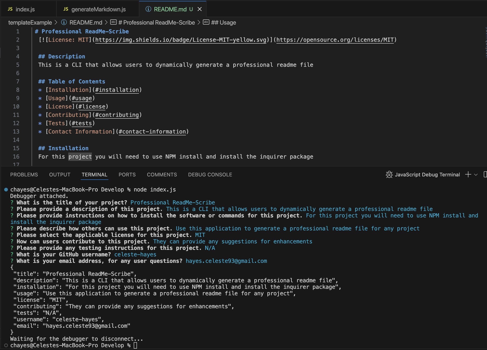

# Professional README Generator 

## Description
A well-written README helps to provide clear and essential information about a project. It sets expectations for users and contributors, making it easier for them to understand what the project does, how to use it, and how to get started. With a good README you can improve the project’s visibility, encourage collaboration, and ensure that others can easily integrate or build upon your work.

To make this easier, I created a command-line tool that generates a professional README.md file from user input. Using the Inquirer package, the tool helps you quickly create a README, so you can focus more on building your project.
  
Invoke the application with the following command:

```
node index.js
```
    
Because this is a command-line application and it won’t be deployed, here is a <a href="https://drive.google.com/file/d/1nyvPqpP14EHr1-10Gu5h6rXXdxzkxMtM/view?usp=sharing" target="_blank">Link</a> to a video walkthrough that demonstrates the functionality of the application.

## Application Running in Command Line
The following picture shows the command line functionality of the program:
    

## User Story

```md
AS A developer
I WANT a README generator
SO THAT can quickly create a professional README for a new project
```

## Acceptance Criteria

```md
GIVEN a command-line application that accepts user input
WHEN I am prompted for information about my application repository
THEN a quality, professional README.md is generated with the title of your project and sections entitled Description, Table of Contents, Installation, Usage, License, Contributing, Tests, and Questions
WHEN I enter my project title
THEN this is displayed as the title of the README
WHEN I enter a description, installation instructions, usage information, contribution guidelines, and test instructions
THEN this information is added to the sections of the README entitled Description, Installation, Usage, Contributing, and Tests
WHEN I choose a license for my application from a list of options
THEN a badge for that license is added hear the top of the README and a notice is added to the section of the README entitled License that explains which license the application is covered under
WHEN I enter my GitHub username
THEN this is added to the section of the README entitled Questions, with a link to my GitHub profile
WHEN I enter my email address
THEN this is added to the section of the README entitled Questions, with instructions on how to reach me with additional questions
WHEN I click on the links in the Table of Contents
THEN I am taken to the corresponding section of the README
```
## Application Requirements

* A fully functional command-line application that generates a README.md file based on user input. 
* <a href="https://github.com/celeste-hayes/Pro-ReadMe-Scribe" target="_blank">GitHub Repo Link</a>.

## The Generated README feature includes the following sections: 

  * Title
  * Description
  * Table of Contents
  * Installation
  * Usage
  * License
  * Contributing
  * Tests
  * Questions

## Contact Information
For additional questions about this project, you can contact me: 
* GitHub: celeste-hayes